# Network Call and Authentication Flow

```mermaid
sequenceDiagram
    participant User
    participant Frontend
    participant GitHub
    participant Middleware
    participant Docker
    participant WettyContainer as Wetty Container<br/>(Port 13001+)
    participant DevContainer as Dev Container<br/>(SSH Port 22)

    %% Authentication Flow
    Note over User,GitHub: Initial Authentication
    User->>Frontend: Access application
    Frontend->>GitHub: OAuth login request
    GitHub->>Frontend: OAuth token
    Frontend->>Frontend: Store auth token

    %% Session Creation Flow
    Note over User,DevContainer: Session Creation & Port Allocation
    User->>Frontend: Request new session
    Frontend->>+Middleware: POST /api/sessions<br/>Header: Authorization: Bearer {token}
    
    Middleware->>GitHub: Validate token with GitHub API
    GitHub->>Middleware: User info (username, email, etc.)
    
    Middleware->>Middleware: allocateWettyHostPort()<br/>• Start from port 13001<br/>• Check Docker containers<br/>• Find next available port<br/>• Reserve in allocatedPorts Set
    
    Middleware->>+Docker: Create network: claude-{sessionId}
    Docker->>-Middleware: Network created
    
    Middleware->>+Docker: Create dev container<br/>• Image: {devImage}<br/>• Network: claude-{sessionId}<br/>• SSH port 22 (internal)
    Docker->>-Middleware: Dev container started
    
    Middleware->>+Docker: Create wetty container<br/>• Image: {wettyImage}<br/>• Network: claude-{sessionId}<br/>• Port binding: 3001→{allocatedPort}<br/>• SSH keys mounted
    Docker->>-Middleware: Wetty container started
    
    Middleware->>-Frontend: Session created<br/>{sessionId, wettyHostPort, etc.}
    Frontend->>User: Session ready

    %% Terminal Access Flow
    Note over User,WettyContainer: Terminal Access via Dynamic Port
    User->>Frontend: Click "Open Terminal"
    Frontend->>+Middleware: GET /proxy/terminal/{sessionId}/wetty<br/>Header: Authorization: Bearer {token}
    
    Middleware->>Middleware: extractSessionId(req.url)
    Middleware->>GitHub: Verify auth token
    GitHub->>Middleware: User validated
    Middleware->>Middleware: Check session ownership<br/>(userId matches session)
    
    Middleware->>Middleware: getSession(sessionId)<br/>• Get wettyHostPort from session
    Middleware->>+WettyContainer: Proxy to http://localhost:{wettyHostPort}/wetty<br/>• Path rewrite: /proxy/terminal/{id}/wetty → /wetty<br/>• Add auth headers
    WettyContainer->>-Middleware: Wetty interface HTML
    Middleware->>-Frontend: Terminal interface
    Frontend->>User: Terminal displayed

    %% WebSocket Upgrade for Terminal
    Note over User,WettyContainer: WebSocket Terminal Session
    Frontend->>+Middleware: WebSocket upgrade /proxy/terminal/{sessionId}/wetty
    Middleware->>Middleware: Same auth validation as above
    Middleware->>+WettyContainer: Upgrade to WebSocket<br/>ws://localhost:{wettyHostPort}/wetty
    WettyContainer->>DevContainer: SSH connection (port 22)
    WettyContainer->>-Middleware: WebSocket established
    Middleware->>-Frontend: WebSocket connection
    
    loop Terminal Interaction
        User->>Frontend: Type commands
        Frontend->>Middleware: WebSocket message
        Middleware->>WettyContainer: Forward message
        WettyContainer->>DevContainer: SSH command
        DevContainer->>WettyContainer: Command output
        WettyContainer->>Middleware: WebSocket response
        Middleware->>Frontend: Forward response
        Frontend->>User: Display output
    end

    %% Asset Loading Flow
    Note over User,WettyContainer: Static Asset Loading
    Frontend->>+Middleware: GET /wetty/assets/app.css
    Middleware->>Middleware: wettyAssetsProxy pathFilter<br/>• Check if asset request (.css, .js, etc.)
    Middleware->>Middleware: getAllocatedPorts()[0]<br/>• Route to first available wetty container
    Middleware->>+WettyContainer: GET http://localhost:{firstPort}/wetty/assets/app.css
    WettyContainer->>-Middleware: CSS file
    Middleware->>-Frontend: CSS file

    %% Dev Container Access Flow
    Note over User,DevContainer: Development Container Access
    User->>Frontend: Request dev container access
    Frontend->>+Middleware: GET /proxy/dev/{sessionId}/some-endpoint<br/>Header: Authorization: Bearer {token}
    Middleware->>Middleware: Same auth validation as terminal
    Middleware->>+DevContainer: Proxy to http://{devIP}:port<br/>• Path rewrite: /proxy/dev/{id} → /
    DevContainer->>-Middleware: Response
    Middleware->>-Frontend: Forwarded response

    %% Session Cleanup Flow
    Note over User,Docker: Session Cleanup
    User->>Frontend: End session / logout
    Frontend->>+Middleware: DELETE /api/sessions/{sessionId}
    Middleware->>Middleware: releaseWettyHostPort(port)<br/>• Remove from allocatedPorts Set
    Middleware->>+Docker: Stop & remove wetty container
    Docker->>-Middleware: Container removed
    Middleware->>+Docker: Stop & remove dev container  
    Docker->>-Middleware: Container removed
    Middleware->>+Docker: Remove network
    Docker->>-Middleware: Network removed
    Middleware->>-Frontend: Session destroyed
```



## Key Components Breakdown

### 1. Port Allocation Logic
```typescript
// Location: middleware/src/services/docker-container-service.ts:49-88
private async allocateWettyHostPort(): Promise<number> {
  // 1. Check existing session ports
  // 2. Check currently allocated ports (race condition prevention)
  // 3. Check real Docker container port usage
  // 4. Find next available port starting from 13001
  // 5. Reserve port immediately in allocatedPorts Set
}
```

### 2. Authentication Validation
```typescript
// Location: middleware/src/server.ts:369-384
const checkAuthAndSession = async (req, sessionId) => {
  // 1. Extract Bearer token from Authorization header
  // 2. Validate with GitHub API
  // 3. Check session ownership (userId matches)
  // 4. Return user info or null
}
```

### 3. Proxy Configuration
```typescript
// Location: middleware/src/server.ts:387-434
const terminalProxy = createProxyMiddleware({
  pathFilter: '/proxy/terminal/{sessionId}/wetty',
  router: async (req) => {
    // 1. Extract sessionId from URL
    // 2. Validate auth and session ownership  
    // 3. Get wettyHostPort from session data
    // 4. Return target: http://localhost:{port}
  },
  pathRewrite: '/proxy/terminal/{id}/wetty → /wetty'
});
```

### 4. Security Model
- **Authentication**: GitHub OAuth tokens validated on every request
- **Authorization**: Session ownership verified (user can only access their sessions)
- **Network Isolation**: Each session gets its own Docker network
- **Port Management**: Dynamic allocation prevents conflicts
- **Proxy Layer**: No direct container access - all traffic routed through authenticated middleware

### 5. Port Mapping Architecture
```
External Request → Middleware (Port 3000) → Wetty Container (Host Port 13001+) → Internal Port 3001
                                         → Dev Container (Network Internal) → SSH Port 22
```